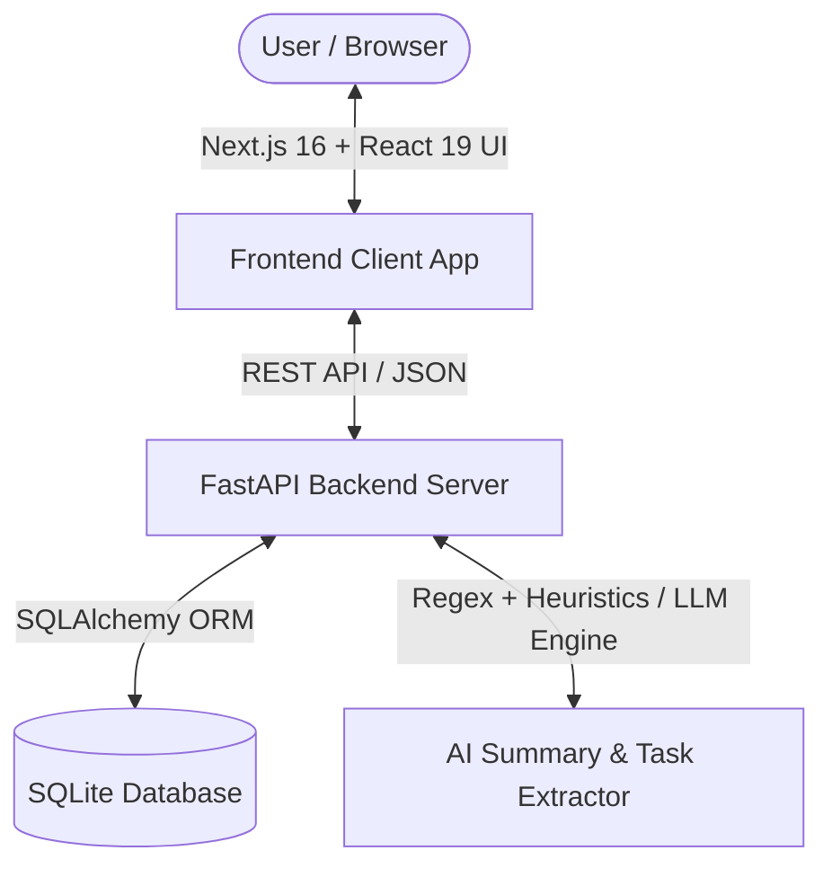

# ⚡ Fireflies.ai Clone — Enterprise Meeting Intelligence Platform

> **SDE Fullstack Assignment Submission**  
> *A full-stack, production-grade replica of the Fireflies.ai meeting-assistant platform featuring bi-directional transcript-to-media playback synchronization, dynamic LLM summary generation, task checklist management, and a standalone AskFred AI Assistant.*

---

## 📸 Executive Summary & Architecture Overview

The platform replicates the core post-meeting workflows of **Fireflies.ai**. Users can browse meeting libraries, inspect interactive transcripts with speaker labels and timestamps, generate multi-style AI briefs, track assigned tasks, and query an LLM across all workspace meetings.



---

## ✨ Core Feature Matrix

| Feature Module | Description & Capabilities | Status |
| :--- | :--- | :---: |
| 📁 **Meetings Dashboard** | Home view with meeting cards, participant filter popover, date range picker, duration filter, search bar, and recency sorting (`date_desc`). | ✅ Complete |
| 🎙️ **Interactive Transcript** | Speaker avatars, timestamps, live search term highlights, and persistent line highlights (`is_highlighted`) & comments. | ✅ Complete |
| 🔄 **Bi-Directional Media Sync** | Clicking transcript lines seeks media player to timestamp; media playback auto-scrolls and highlights active transcript segments in real time. | ✅ Complete |
| ⏩ **Playback Speed & Skip** | Variable speed playback rates (**1x**, **1.25x**, **1.5x**, **2x**) and **-5s / +5s** quick skip controls. | ✅ Complete |
| 🧠 **Dynamic AI Summaries** | Overview, key topics (`#SlowQueries`, `#TursoRedirects`), summary style switching (**General**, **Executive**, **Technical**, **Action-Centric**), and custom AI prompt refinement. | ✅ Complete |
| ✅ **Task Management (CRUD)** | Action item checklist with completion checkboxes, assignee tags, task creation, and backend SQLite persistence. | ✅ Complete |
| 🤖 **AskFred AI Workspace** | Standalone global AI assistant with scope switching (`# All Workspace Meetings`, `# My Meetings`, `Specific Notebook`), preset prompts, and clickable source citations. | ✅ Complete |
| 💾 **Meeting CRUD & Uploads** | Drag-and-drop file upload (`.txt`, `.vtt`, `.json`, `.mp4`), transcript text parsing, metadata editing, and meeting deletion with confirmation modal. | ✅ Complete |
| 📥 **Markdown Export** | Export meeting notes, summaries, and full transcripts as formatted Markdown files (`/meetings/{id}/export/markdown`). | ✅ Complete |
| 🔄 **State Persistence** | View state and meeting selections persist across page reloads via `localStorage` & URL query parameters (`?view=detail&id=1`). | ✅ Complete |

---

## 🛠️ Technical Stack & Architecture

### **Frontend**
- **Framework**: Next.js 16 (App Router, Turbopack)
- **Language**: TypeScript (Strict Mode)
- **Styling**: Vanilla CSS, Tailwind CSS v4, Glassmorphism, Modern HSL Gradients
- **Icons**: Lucide React Icons
- **State Management**: React Hooks (`useState`, `useEffect`, `useCallback`, `useRef`), Browser `localStorage`, and Web History API synchronization

### **Backend**
- **Framework**: FastAPI (Python 3.12)
- **ORM & Database**: SQLAlchemy 2.0 + SQLite (`backend/meetings.db`)
- **Data Validation**: Pydantic v2 schemas
- **Server**: Uvicorn ASGI Server

---

## 🗄️ Relational Database Schema

Managed via SQLAlchemy ORM with foreign key cascades:

```sql
-- 1. Meetings Table
CREATE TABLE meetings (
    id INTEGER PRIMARY KEY AUTOINCREMENT,
    title VARCHAR(255) NOT NULL,
    date DATETIME NOT NULL,
    duration INTEGER NOT NULL, -- Duration in seconds
    owner_id INTEGER NOT NULL,
    created_at DATETIME DEFAULT CURRENT_TIMESTAMP,
    FOREIGN KEY (owner_id) REFERENCES users(id) ON DELETE CASCADE
);

-- 2. Transcripts Table
CREATE TABLE transcript_segments (
    id INTEGER PRIMARY KEY AUTOINCREMENT,
    meeting_id INTEGER NOT NULL,
    speaker_name VARCHAR(100) NOT NULL,
    timestamp_seconds INTEGER NOT NULL,
    text TEXT NOT NULL,
    is_highlighted BOOLEAN DEFAULT 0,
    comment TEXT,
    FOREIGN KEY (meeting_id) REFERENCES meetings(id) ON DELETE CASCADE
);

-- 3. Summaries Table
CREATE TABLE summaries (
    id INTEGER PRIMARY KEY AUTOINCREMENT,
    meeting_id INTEGER NOT NULL UNIQUE,
    overview_text TEXT NOT NULL,
    key_topics JSON NOT NULL, -- Stored as JSON array
    FOREIGN KEY (meeting_id) REFERENCES meetings(id) ON DELETE CASCADE
);

-- 4. Action Items Table
CREATE TABLE action_items (
    id INTEGER PRIMARY KEY AUTOINCREMENT,
    meeting_id INTEGER NOT NULL,
    text TEXT NOT NULL,
    assignee VARCHAR(100),
    is_completed BOOLEAN DEFAULT 0,
    FOREIGN KEY (meeting_id) REFERENCES meetings(id) ON DELETE CASCADE
);
```

---

## 🔌 API Endpoint Specifications

### **Meetings Management**
- `GET /meetings`: List meetings with search (`search=`), participant (`participant=`), date filtering (`date_from=`, `date_to=`), and sorting (`sort=date_desc|date_asc|title_asc|title_desc`).
- `POST /meetings`: Create meeting and parse raw transcript text (`.txt`/`.vtt`/`.json`) or structured segments.
- `GET /meetings/{id}`: Fetch detailed meeting payload (transcript, summary, action items).
- `PUT /meetings/{id}`: Update title, date, duration, and participant list.
- `DELETE /meetings/{id}`: Delete meeting and cascade-delete child records.

### **AI Summaries & Intelligence**
- `POST /meetings/{id}/regenerate-summary`: Dynamically regenerate AI summary by style preset (`general`, `executive`, `technical`, `action_centric`) or custom prompt.
- `GET /meetings/{id}/export/markdown`: Generate and download Markdown report.

### **Transcripts & Search**
- `GET /meetings/{id}/transcript/search`: Real-time text search across transcript segments.
- `PUT /transcript-segments/{id}`: Toggle line highlights (`is_highlighted`) or edit notes (`comment`).

### **Action Items (Tasks)**
- `POST /meetings/{id}/action-items`: Create new task item.
- `PUT /action-items/{id}`: Toggle task completion or update text/assignee.
- `DELETE /action-items/{id}`: Delete task item.

---

## 🚀 Local Installation & Execution Guide

### **Prerequisites**
- **Node.js**: v18.0.0 or higher
- **Python**: v3.10 or higher

---

### **Step 1: Backend Setup (FastAPI)**

```bash
# 1. Navigate to backend directory
cd backend

# 2. Create virtual environment
python3 -m venv venv
source venv/bin/activate

# 3. Install requirements
pip install -r requirements.txt

# 4. Seed database with sample meetings & transcripts
python app/seed.py

# 5. Start FastAPI server on port 8000
uvicorn app.main:app --host 127.0.0.1 --port 8000 --reload
```

> **API Documentation**: Open `http://127.0.0.1:8000/docs` in your browser for the interactive Swagger API UI.

---

### **Step 2: Frontend Setup (Next.js)**

```bash
# 1. Open a new terminal and navigate to frontend directory
cd frontend

# 2. Install dependencies
npm install

# 3. Launch Next.js development server
npm run dev
```

> **Application UI**: Open `http://localhost:3000` in your browser. Demo credentials (`demo@fireflies.local` / `demo123`) are pre-filled on the login screen for instant 1-click access.

---

## 🏆 Quality Highlights & Design Rationale

1. **Fireflies Brand Fidelity**:
   - Recreated official Fireflies logo mark, dark-mode sign-in view with terms disclaimer and security badges, and lavender workspace headers.
2. **Bi-Directional Player Sync**:
   - Uses React `useRef` and `HTMLMediaElement` event listeners for millisecond-accurate transcript tracking and auto-scrolling (`scrollIntoView`).
3. **State Persistence**:
   - Keeps browser URL query parameters (`?view=meetings`, `?view=detail&id=1`) and `localStorage` in sync so page refreshes maintain exact UI state.
