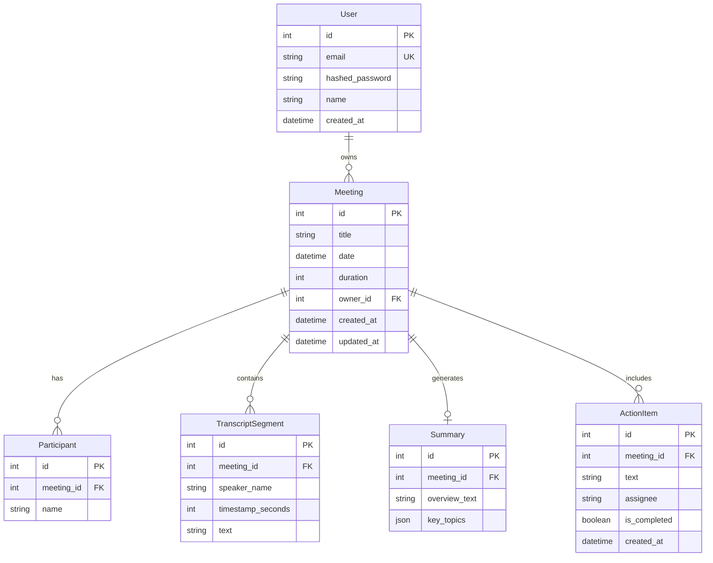

# Fireflies.ai Clone Backend (FastAPI)

A clean, production-ready backend for a meeting notes and transcription platform (Fireflies.ai clone). Built using FastAPI, SQLAlchemy, and SQLite (with full support for Turso/libSQL cloud databases).

---

## File Structure
```text
app/
  core/
    config.py           # Setting configuration (loads from .env)
    database.py         # SQLAlchemy engine, session maker, get_db dependency
    security.py         # Password hashing and stateless JWT token encoders
  routers/
    meetings.py         # Meetings CRUD & heuristic summary generators
    transcripts.py      # Transcript querying & in-meeting search engine
    action_items.py     # Action items tasks CRUD endpoints
  models.py             # All SQLAlchemy Database Models
  schemas.py            # All Pydantic v2 validation models
  auth.py               # Sign up, Log in, and authentication dependencies
  seed.py               # Idempotent database seed script
  main.py               # Application entrypoint & CORS middleware
requirements.txt        # Frozen dependencies
.env.example            # Environment variables template
```

---

## Database Schema



### Cascading Deletes
All foreign key relations are configured with `ondelete="CASCADE"`. Deleting a meeting automatically purges all of its associated participants, transcript segments, summaries, and action items from the database.

---

## API Endpoints Reference

All endpoints (except login & registration) require a standard **JWT Bearer Token** in the authorization header:
`Authorization: Bearer <token>`

### 1. Authentication
* **`POST /auth/register`**: Creates a new user account.
  * *Request Body*: `UserCreate` (email, name, password)
* **`POST /auth/login`**: Authenticates user and returns JWT.
  * *Request Body*: `UserLogin` (email, password)
  * *Response*: `{"access_token": "...", "token_type": "bearer"}`

### 2. Meetings
* **`GET /meetings`**: List meetings owned by current user.
  * *Query Params*:
    - `search` (Search term for title)
    - `date_from` / `date_to` (Filter by range)
    - `participant` (Filter by participant name)
    - `sort` (`date_asc`, `date_desc`, `title_asc`, `title_desc`)
* **`POST /meetings`**: Create a new meeting.
  * *Request Body*: `MeetingCreate` (title, date, duration, participants, transcript_text, OR transcript_segments)
  * *Behavior*: If `transcript_text` is raw pasted text, it is auto-parsed into speaker segments. Heuristics are run to auto-generate a summary and action items.
* **`GET /meetings/{id}`**: Fetch full meeting details (metadata, participants, transcript, summary, and action items).
* **`PUT /meetings/{id}`**: Edit meeting metadata (title, date, duration, participants list).
* **`DELETE /meetings/{id}`**: Delete meeting (triggering cascade delete).

### 3. Transcript Search
* **`GET /meetings/{meeting_id}/transcript/search`**: Search for keywords inside a specific meeting's transcript.
  * *Query Params*: `q` (search query)
  * *Response*: Matching transcript segments with speakers and timestamps.

### 4. Action Items
* **`POST /meetings/{meeting_id}/action-items`**: Create a custom action item.
  * *Request Body*: `ActionItemCreate` (text, assignee)
* **`PUT /action-items/{id}`**: Edit task description, assignee, or toggle completion (`is_completed`).
* **`DELETE /action-items/{id}`**: Delete the action item.

---

## Running the Application

1. **Re-create and activate environment**:
   ```bash
   python3.13 -m venv venv
   source venv/bin/activate
   pip install -r requirements.txt
   ```
2. **Setup environment variables**:
   Create a `.env` file in the root of the project:
   ```env
   SECRET_KEY="some-secure-secret-key"
   JWT_ALGORITHM="HS256"
   ACCESS_TOKEN_EXPIRE_MINUTES=1440
   ```
3. **Start the API server**:
   ```bash
   uvicorn app.main:app --reload
   ```
4. **Access the docs**:
   Open [http://127.0.0.1:8000/docs](http://127.0.0.1:8000/docs) in your browser to view and test all endpoints interactively.
